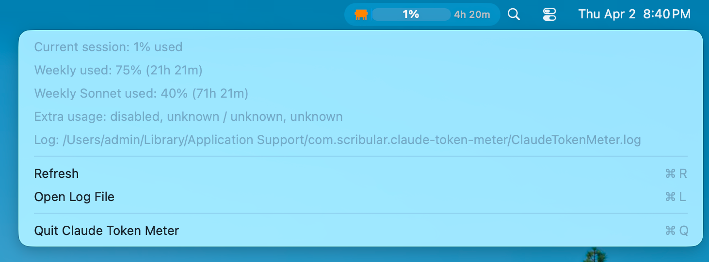

<h1 align="center">Claude Token Meter</h1>


<p align="center">
  <a href="./LICENSE">
    
  </a>
  <br/>
Context switching costs are real. 
Now you can monitor your Claude API usage in the macOS menu bar.
</p>

<p align="center">

</p>

## Is it safe?

- Uses your Claude OAuth token directly from Keychain. No additional copies of your token are stored.
- Sandboxed app.
- Only makes API calls to Anthropic's production API.
- Build it locally if you're unsure.

## Install

**Option 1: Download from Releases**

Install the `.dmg` from [Releases](https://github.com/pi0neerpat/claude-token-meter/releases)

**Option 2: Build Locally**

```bash
./build.sh
```

You'll need to grant the app permission to access your Claude Oauth token. 


## Usage

Click the menu bar icon to see your usage. The icon color shows your status:
- **Orange** — comfortable
- **Yellow** — getting close
- **Red** — approaching limit


Click the menu for more details and refresh controls.


