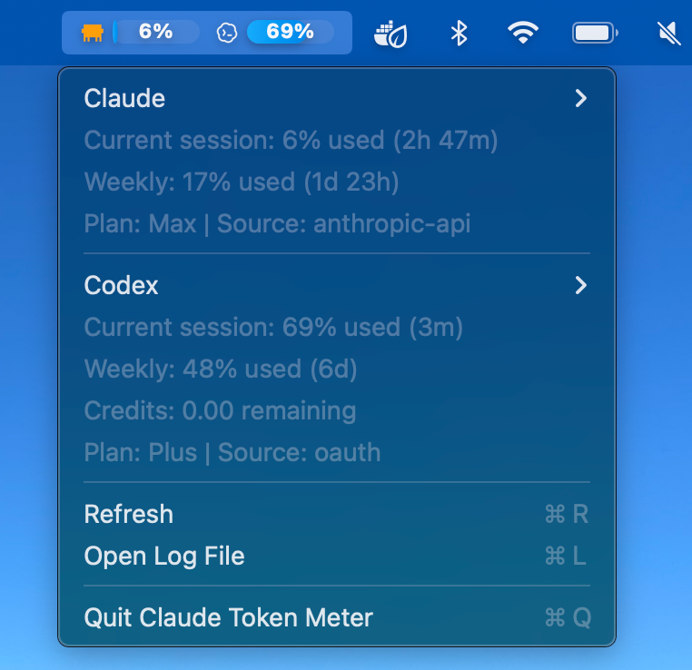
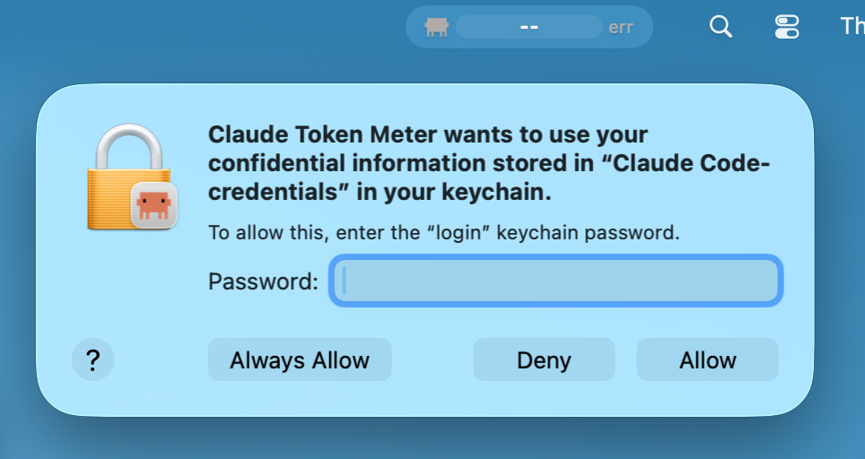

<h1 align="center">Agent Token Monitor</h1>

<p align="center">
  <a href="./LICENSE">
    
  </a>
  <br/>
Monitor your Claude and Codex subs with a lightweight macOS taskbar item.
</p>

<p align="center">

</p>

## Install

**Option 1: Download from Releases**

Install the `.dmg` from [Releases](https://github.com/pi0neerpat/claude-token-meter/releases)

**Option 2: Build Locally**

```bash
./build.sh
```

You'll need to grant the app permission to access your Claude Oauth token. 



And for Codex, we only need access to auth.json. Otherwise the app is sandboxed.

## Usage

Click the menu bar icon to see your usage. The icon color shows your status:
- **Orange** — comfortable
- **Yellow** — getting close
- **Red** — approaching limit


